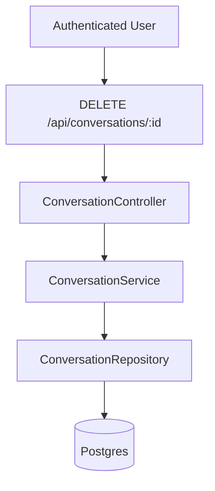
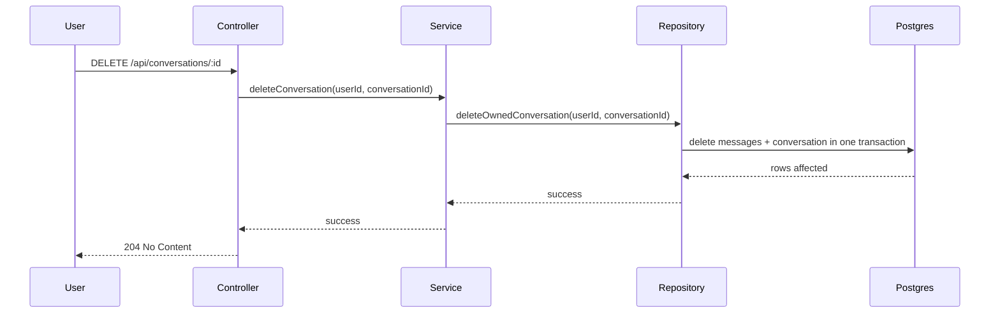

# Delete Conversation Example Architecture

## 1. Planning Mode
- Mode: `Existing System`
- Current Phase: `Part 1`
- Objective: Add a user-scoped delete-conversation capability without changing message storage ownership or existing conversation-read behavior.

## 2. Success Criteria
- Users can delete only their own conversations.
- Deletion removes the conversation and its messages in one transaction.
- Review can verify ownership rules, negative paths, and evidence without replaying chat.

## 2.5 Harness Contract
- Authoritative inputs: approved delete-conversation scope, existing API/repository layering, current ownership model
- Forbidden implementation inputs: guessed admin bypasses, unapproved soft-delete rewrite, undocumented new queues or services
- Required durable artifacts: `design.md`, `test.md`, `task.md`, `verification.md`
- Test artifact path: `docs/DevoSkill/examples/delete-conversation/test.md`
- Verification artifact path: `docs/DevoSkill/examples/delete-conversation/verification.md`
- Required verification evidence: ownership failure path, successful deletion path, file-tree reconciliation, executed test suites
- Forbidden shortcuts: deleting without ownership check, claiming tests without mapping them back to the contract

## 3. Current Reality / As-Is
- Existing API routes read conversations through controller -> service -> repository layering.
- Conversation ownership is already scoped by `user_id`.
- No delete endpoint exists yet.
- Conversation messages live under the same logical ownership boundary as the parent conversation.

## 4. Target Shape / To-Be



## 5. Delta Scope
- In scope: delete endpoint, service orchestration, repository transactional delete, ownership enforcement, test contract, verification evidence
- Out of scope: bulk deletion, admin deletion, soft delete, restore flow
- Explicitly deferred: deletion audit log

## 6. Component Responsibilities
### 6.1 ConversationController
- Responsibility: Parse request identity and conversation id, call service, map domain errors to HTTP responses.
- Inputs: authenticated request, route params
- Outputs: `204 No Content`, `404`, `403`, `500`
- Dependencies: `ConversationService`
- Notes: no DB access

### 6.2 ConversationService
- Responsibility: Enforce ownership-aware delete behavior and coordinate repository transaction.
- Inputs: `user_id`, `conversation_id`
- Outputs: delete success or domain error
- Dependencies: `ConversationRepository`
- Notes: no HTTP details

### 6.3 ConversationRepository
- Responsibility: Execute transactional delete of conversation and child messages.
- Inputs: `user_id`, `conversation_id`
- Outputs: affected row status
- Dependencies: Postgres transaction
- Notes: owns persistence details only

## 7. Key Flows
### 7.1 Main Flow


### 7.2 Authorization / Ownership Flow
- Controller extracts authenticated `user_id`.
- Service passes `user_id` unchanged into repository boundary.
- Repository delete predicate requires both `conversation_id` and `user_id`.
- Missing matching ownership returns `not found or forbidden` according to the approved API contract.

## 8. Constraints and Boundaries
- Technical constraints: preserve existing controller/service/repository layering
- Pattern/style constraints: follow existing project pattern for tests unless explicitly approved otherwise
- External contracts or schemas required from the user: none for this example
- Operational constraints: delete must be transactional
- Authorization and ownership constraints: user may delete only owned conversation tree
- Artifact hygiene constraints: no generated fixtures committed outside approved test paths

## 9. Open Questions
- None for this example.

## 10. Phased Delivery Plan
### Part 1
- Goal: add delete-conversation behavior and its full planning/testing/evidence chain
- Components touched: controller, service, repository, tests
- Must not change: read flows, conversation ownership model
- Exit condition: design/test/task/verification all agree and required tests pass

## 11. Project Layout

```text
docs/DevoSkill/examples/delete-conversation/
├── architecture.md
├── design.md
├── task.md
├── test.md
└── verification.md
```

## 12. Verification Surface
- Key files/modules to inspect: controller delete handler, service delete method, repository transactional delete
- Key flows to verify: happy-path deletion, ownership rejection, missing conversation
- Key authorization / ownership boundaries: repository predicate must include `user_id`
- Required durable artifacts to inspect: `test.md`, `verification.md`
- Human-provided inputs still required: none
