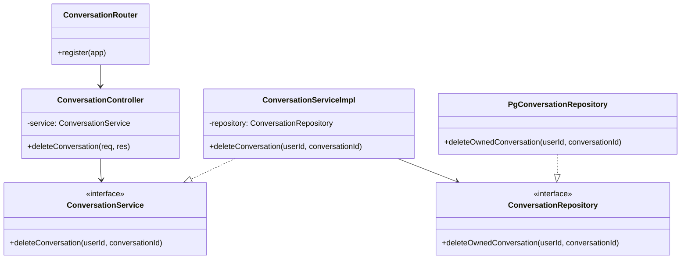

# Design: Delete Conversation

Generated during Planning. Development follows this document and the paired `test.md`.

## Folder Structure

```text
src/
  controllers/
    conversation.controller.ts
  services/
    conversation.service.ts
  repositories/
    conversation.repository.ts
  router/
    conversation.router.ts
tests/
  integration/
    conversation-delete.integration.test.ts
  acceptance/
    conversation-delete.feature
```

## Class Diagram



## Class Responsibilities

### `ConversationController`
- Owns HTTP request parsing, authenticated identity extraction, and HTTP response mapping.
- Does not own delete rules or transaction logic.
- Changed in this feature: adds `DELETE /api/conversations/:id` handler only.

### `ConversationServiceImpl`
- Owns orchestration of delete behavior and domain-level failure mapping.
- Does not own SQL or HTTP response shape.
- Changed in this feature: adds delete use case entrypoint.

### `PgConversationRepository`
- Owns transactional deletion of the conversation row and child messages.
- Does not own authentication or HTTP semantics.
- Changed in this feature: adds ownership-scoped transactional delete.

## Flow Mapping

### `DELETE /api/conversations/:id`
1. Router binds delete endpoint.
2. Controller reads authenticated `user_id` and route `conversation_id`.
3. Service validates input shape and invokes repository delete.
4. Repository opens transaction and deletes child messages, then parent conversation.
5. Repository enforces ownership in the delete predicate.
6. Service maps `no rows deleted` to domain failure.
7. Controller emits `204`, `404`, or `403` according to domain outcome.

## Behavior Contract

- Resource boundaries: `user_id` and `conversation_id` must cross every layer unchanged.
- Endpoint matrix:
  - `DELETE /api/conversations/:id`
    - Request owner: authenticated user
    - Allowed state: conversation exists and is owned by requester
    - Side effects: deletes child messages and parent conversation
    - Error cases: unauthenticated, not found, not owned, repository failure
- State transitions:
  - `active -> deleted` is allowed
  - `deleted -> active` is forbidden in this scope
- Ownership rules:
  - Repository predicate must include both `conversation_id` and `user_id`
  - Service must not expose a delete path without ownership input

## Test Derivation Hooks

- Unit-test seam: `ConversationServiceImpl.deleteConversation`
- Integration-test seam: controller -> service -> repository -> database delete flow
- BDD seam: user deletes own conversation vs. other user's conversation
- Expected durable test artifact path: `docs/DevoSkill/examples/delete-conversation/test.md`

## Verification Artifacts

- Runtime checks: successful delete returns `204` and removes owned rows
- Negative-path checks: non-owned conversation cannot be deleted
- Artifact hygiene: no generated fixtures or DB dumps committed
- Expected durable artifact path: `docs/DevoSkill/examples/delete-conversation/verification.md`
