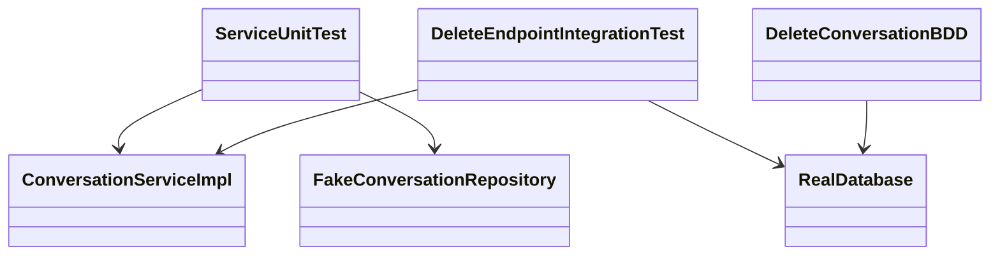

# Delete Conversation Test Contract

This document derives from `design.md` and defines how the delete-conversation feature should be proven.

## 1. Test Scope
- Feature / phase: `Delete Conversation / Part 1`
- Depends on `design.md` version: `initial example version`
- Depends on `architecture.md` sections: `Target Shape / To-Be`, `Key Flows`, `Constraints and Boundaries`
- Out-of-scope behaviors: restore flow, bulk delete, admin override

## 2. Testing Methodology
- Selected methodology: `Follow Existing Project Pattern`
- Why this methodology fits the feature: existing-system change should preserve the project's current testing style rather than impose a new one
- Existing project testing pattern to follow: unit tests for service rules, integration tests for endpoint + repository behavior, BDD-style acceptance scenario for ownership language
- Approved exceptions to the default methodology: none

## 3. Test Architecture
- Test layers in scope: `unit`, `integration`, `acceptance`
- Primary test subjects: `ConversationServiceImpl`, delete endpoint, repository transaction boundary
- Required test doubles / fixtures: repository fake for unit test, seeded owned/non-owned conversations for integration/acceptance
- Real dependencies allowed in test runs: ephemeral database in integration layer only
- Mock / stub / fake policy: unit tests may fake repository; integration and acceptance tests must use real persistence
- Data setup / teardown rules: create one owned conversation, one non-owned conversation, then clean both between runs

## 4. Test Diagram

## 5. Test Flow Mapping

### 5.1 Owned conversation delete
- Source production flow: `DELETE /api/conversations/:id`
- Primary layer proving it: `integration`
- Setup: authenticated user with owned conversation and child messages
- Expected assertions: response `204`; conversation row removed; child messages removed
- Ownership / authorization checks: `user_id` in delete predicate
- Negative paths: none in this case

### 5.2 Non-owned conversation delete
- Source production flow: ownership boundary in delete repository predicate
- Primary layer proving it: `acceptance`
- Setup: authenticated user attempts to delete another user's conversation
- Expected assertions: conversation remains; failure response returned
- Ownership / authorization checks: requester cannot cross ownership boundary
- Negative paths: forbidden/not-found path depending on approved API contract

### 5.3 Service mapping for missing delete
- Source production flow: service maps zero rows deleted into domain failure
- Primary layer proving it: `unit`
- Setup: fake repository returns `not found`
- Expected assertions: service returns domain error without HTTP coupling
- Ownership / authorization checks: service requires ownership-aware repository call
- Negative paths: missing conversation

## 6. Traceability Matrix

### 6.1 Class Responsibilities -> Unit Tests
- `ConversationServiceImpl owns orchestration of delete behavior` -> `conversation.service.unit.test.ts`
- `ConversationServiceImpl maps repository miss into domain failure` -> `conversation.service.unit.test.ts`

### 6.2 Flow Mapping -> Integration Tests
- `DELETE /api/conversations/:id` happy path -> `conversation-delete.integration.test.ts`
- `repository deletes child messages then parent` -> `conversation-delete.integration.test.ts`

### 6.3 Behavior Contract -> Acceptance or BDD
- `user may delete only owned conversation tree` -> `conversation-delete.feature`
- `active -> deleted is allowed` -> `conversation-delete.feature`
- `non-owner cannot delete another user's conversation` -> `conversation-delete.feature`

## 7. Test Case Inventory

### 7.1 Happy Paths
- `DEL-001`:
  - Purpose: owner deletes own conversation
  - Layer: `integration`
  - Expected evidence: `204` response and missing rows in DB

### 7.2 Negative Paths
- `DEL-002`:
  - Purpose: delete missing conversation
  - Layer: `unit`
  - Expected failure mode: domain `not found`

### 7.3 Ownership / Authorization
- `DEL-003`:
  - Purpose: non-owner delete attempt rejected
  - Layer: `acceptance`
  - Expected enforcement: no rows deleted and failure response returned

### 7.4 State / Lifecycle
- `DEL-004`:
  - Purpose: deleted conversation does not reappear in same test run
  - Layer: `integration`
  - Expected enforcement: follow-up fetch cannot find deleted conversation

## 8. Execution Rules
- Tests that must exist before implementation proceeds: `DEL-002` unit case and `DEL-003` ownership scenario
- Red -> Green -> Refactor expectations: not required because this example follows existing project pattern instead of strict greenfield TDD
- Scenario-first expectations: acceptance scenario should be written before final endpoint wiring is declared complete
- Minimum suites that must pass before review: service unit suite, delete integration suite, ownership acceptance scenario
- Cases allowed to be deferred and why: none

## 9. Durable Artifacts
- Expected test files or suite locations:
  - `tests/unit/conversation.service.unit.test.ts`
  - `tests/integration/conversation-delete.integration.test.ts`
  - `tests/acceptance/conversation-delete.feature`
- Required command surface:
  - `pnpm test -- conversation.service.unit.test.ts`
  - `pnpm test:integration -- conversation-delete.integration.test.ts`
  - `pnpm test:acceptance -- conversation-delete.feature`
- Expected durable evidence path: `docs/DevoSkill/examples/delete-conversation/verification.md`
- Reviewer spot-check starting points: ownership scenario, service not-found mapping, DB child-message cleanup

## 10. Approved Exceptions
- None
