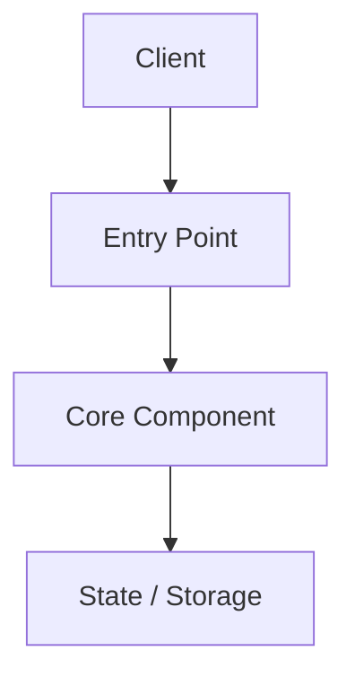
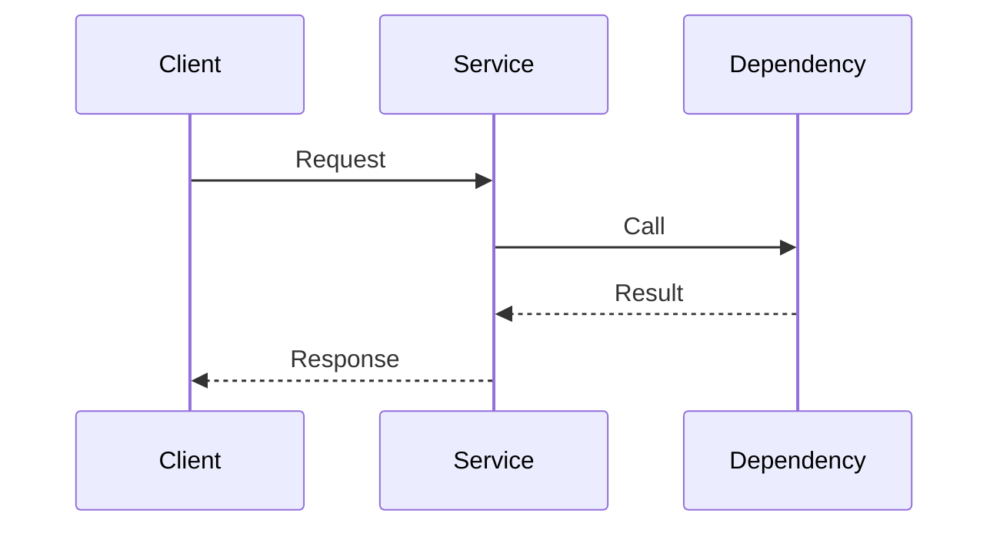

# [Project Name] Effective Architecture

This document contains the currently effective architecture only. It is written for future execution sessions, not for preserving every design conversation.

## 1. Planning Mode
- Mode: `[Greenfield | Existing System | Hybrid]`
- Current Phase: `[Part 1 | Part 2 | ...]`
- Objective: `[One-paragraph description of the outcome this architecture serves]`

## 2. Success Criteria
- [Criterion 1]
- [Criterion 2]
- [Criterion 3]

## 3. Current Reality / As-Is
Only include what a later execution session must know.

- Existing components:
- Existing data/control flow:
- Existing constraints:
- Immovable boundaries:

If this is a true greenfield project, state that there is no inherited runtime architecture yet.

## 4. Target Shape / To-Be
Describe the approved target architecture for the active scope.



## 5. Delta Scope
- In scope:
- Out of scope:
- Explicitly deferred:

## 6. Component Responsibilities
### 6.1 [Component Name]
- Responsibility:
- Inputs:
- Outputs:
- Dependencies:
- Notes:

### 6.2 [Component Name]
- Responsibility:
- Inputs:
- Outputs:
- Dependencies:
- Notes:

## 7. Key Flows
Capture only the flows needed to implement or review this scope.

### 7.1 Main Flow


### 7.2 State / Lifecycle Flow
Use this section when task state, event ordering, or lifecycle transitions are important.

## 8. Constraints and Boundaries
- Technical constraints:
- Pattern/style constraints:
- External contracts or schemas required from the user:
- Operational constraints:

## 9. Open Questions
List only unresolved items that block or shape implementation.

- [Question]
- [Question]

Once resolved, move the answer into the effective sections above and remove the question.

## 10. Phased Delivery Plan
Use this section whenever the scope is too large for one execution pass.

### Part 1
- Goal:
- Components touched:
- Must not change:
- Exit condition:

### Part 2
- Goal:
- Components touched:
- Must not change:
- Exit condition:

## 11. Project Layout
Show only the relevant target or affected structure.

```text
/
├── component1/
├── component2/
└── docs/
```

## 12. Verification Surface
State how later sessions should judge whether the architecture has been respected.

- Key files/modules to inspect:
- Key flows to verify:
- Human-provided inputs still required:
