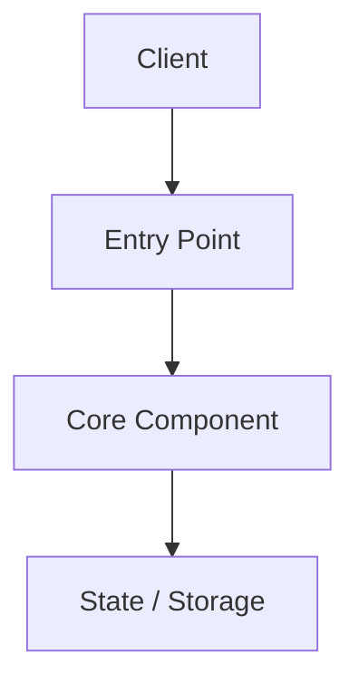
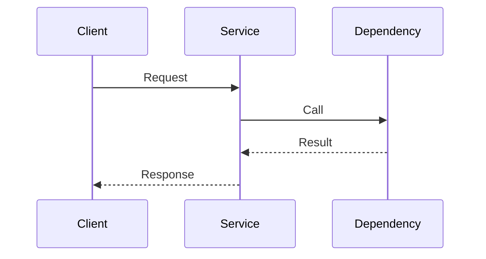

# [Project Name] Effective Architecture

This document contains the currently effective architecture only. It preserves the target shape, boundaries, and behavior deltas without storing every design conversation.
For historical rationale, link to the relevant `project-changelog.md` entry instead of embedding long "why" sections here.

## 1. Planning Mode
- Mode: `[Greenfield | Existing System | Hybrid]`
- Current Phase: `[Part 1 | Part 2 | ...]`
- Objective: `[One-paragraph description of the outcome this architecture serves]`

## 2. Success Criteria
- [Criterion 1]
- [Criterion 2]
- [Criterion 3]

## 2.5 Harness Contract
- Authoritative inputs:
- Forbidden implementation inputs:
- Required durable artifacts:
- Test artifact path:
- Verification artifact path:
- Required verification evidence:
- Forbidden shortcuts:

## 3. Current Reality / As-Is
Only include what a later execution session must know.

- Existing components:
- Existing data/control flow:
- Existing constraints:
- Immovable boundaries:

If this is a true greenfield project, state that there is no inherited runtime architecture yet.

## 4. Target Shape / To-Be
Describe the approved target architecture for the active scope.


```mermaid
graph TD
    Client[Client]
    Entry[Entry Point]
    Core[Core Component]
    Store[State / Storage]

    Client --> Entry
    Entry --> Core
    Core --> Store
```

## 5. Delta Scope
- In scope:
- Out of scope:
- Explicitly deferred:

## 5.5 Behavior Delta
### Added
- [Added behavior]

### Changed
- [Changed behavior]

### Removed
- [Removed behavior]

### Non-Goals
- [Explicit non-goal]

### Review Evidence
- [Required evidence]

## 6. Component Responsibilities
### 6.1 [Component Name]
- Responsibility:
- Inputs:
- Outputs:
- Dependencies:
- Notes:

### 6.2 [Component Name]
- Responsibility:
- Inputs:
- Outputs:
- Dependencies:
- Notes:

## 7. Key Flows
Capture only the flows needed to implement or review this scope.

### 7.1 Main Flow

```mermaid
sequenceDiagram
    participant A as Client
    participant B as Service
    participant C as Dependency

    A->>B: Request
    B->>C: Call
    C-->>B: Result
    B-->>A: Response
```

### 7.2 State / Lifecycle Flow
Use this section when task state, event ordering, or lifecycle transitions are important.

### 7.3 Authorization / Ownership Flow
Use this section when user-scoped resources, streaming endpoints, replay buffers, or job ownership matter.

## 8. Constraints and Boundaries
- Technical constraints:
- Pattern/style constraints:
- External contracts or schemas required from the user:
- Operational constraints:
- Authorization and ownership constraints:
- Artifact hygiene constraints:

## 9. Deferred Questions / Future Decisions
Do not list active-phase implementation choices here. If a question can change current implementation, planning is incomplete and development must not begin.

List only non-blocking future decisions that are not referenced by the active `task.md`.

- [Deferred question]
- [Future-phase decision]

Once a decision becomes active, move the selected answer into the effective sections above and remove the question.

## 10. Phased Delivery Plan
Use this section whenever the scope is too large for one execution pass.

### Part 1
- Goal:
- Components touched:
- Must not change:
- Exit condition:

### Part 2
- Goal:
- Components touched:
- Must not change:
- Exit condition:

## 11. Project Layout
Show only the relevant target or affected structure.

```text
/
├── component1/
├── component2/
└── docs/
```

## 12. Verification Surface
State how later sessions should judge whether the architecture has been respected.

- Key files/modules to inspect:
- Key flows to verify:
- Key authorization / ownership boundaries:
- Required durable artifacts to inspect:
- Required test artifacts to inspect:
- Human-provided inputs still required:
