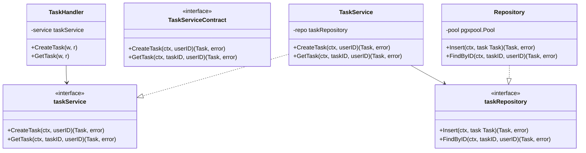

# Design: [Feature Name]

Generated during Planning. Development follows this document — do not deviate without updating it first.

## Folder Structure

```
cmd/
  server/
    main.go               # wiring only: init deps, start server, handle SIGTERM

internal/
  config/
    config.go             # env loading, typed Config struct

  handler/                # HTTP layer — parses request, calls service, writes response
    task.go

  service/                # business logic — owns the repository interface
    task_contract.go      # consumer-defined interfaces only
    task.go               # TaskService concrete implementation only
    task_test.go

  repository/             # data access — implements service's interface
    task.go               # Repository struct

  domain/                 # shared types, status constants, errors
    task.go

  util/
    logger.go             # slog wrapper
```

## Class Diagram



## Naming Rules (enforce before writing any file)

- Package names: single lowercase word — `handler`, `service`, `repository`, `domain`
- File names: `snake_case.go` — `task.go`, `cancel_tracker.go`
- No `.service.go` / `.repository.go` / `.enum.go` suffixes — those are Node.js conventions, not Go
- Interfaces: unexported, defined in the **consumer** package — `taskService` in `handler/`, `taskRepository` in `service/`
- Interface declarations live in dedicated `*_contract.go` files when the package also contains concrete implementations. Do not mix interface definitions and concrete structs in the same file unless the package is trivial and explicitly approved in `design.md`.
- Interface names: describe the role from the consumer's perspective — `taskRepository`, not `ITaskRepository`
- Concrete struct names: simple noun — `TaskService`, `Repository`
- Constructors: `NewTaskService(repo taskRepository) *TaskService`
- No bare struct literals for types with deps — always use constructor
- `slog` for all logging — `log.Printf` / `fmt.Println` are banned
- `signal.NotifyContext` for root context — never `context.Background()` in handlers or workers

## Behavior Contract

- Resource boundaries: list every user-scoped identifier and where ownership must be checked
- Endpoint / stream matrix: each HTTP or SSE path lists caller identity, authorization check, side effects, and negative paths
- Job matrix: each queue or background flow lists producer, consumer, persistence point, and cancel behavior
- State transitions: list allowed transitions and forbidden transitions explicitly

## Verification Artifacts

- Runtime checks that must be persisted or be directly reproducible from repository state
- Negative-path checks that must be evidenced
- Artifact hygiene rules for binaries, build output, uploads, generated files, and traces
- Expected durable artifact path: `<feature-folder>/verification.md`
