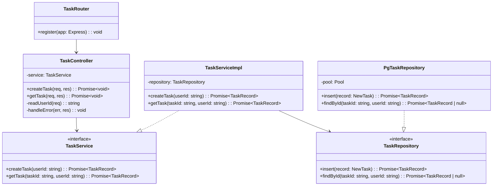

# Design: [Feature Name]

Generated during Planning. Development follows this document — do not deviate without updating it first.

## Source Inputs

- Architecture:
- Study:
- Changelog:
- Code read surface:
- User-provided inputs:
- Local operator notes, if any:

## Relevant Structure

```
src/
  controllers/
    [domain].controller.ts
  services/
    [domain].service.ts
  repositories/
    [domain].repository.ts
  types/
    [domain].interface.ts     # interfaces and types
    [domain].enum.ts          # enums (split out if large)
  util/
    [helper].ts               # stateless helpers, no layer affiliation
  config/
    env.ts
  router/
    [domain].router.ts
  index.ts
```

## Boundary Diagram



## Class Responsibilities

> Class diagrams express structure only. This section explains each class's **responsibility boundary** and **design rationale** so future developers do not have to reverse-engineer intent from code.

One subsection per class in the diagram. Use this pattern:

### `ClassName`
- What it **owns** (one-sentence boundary definition)
- What it **does not own** (explicit exclusions to prevent scope creep)
- If this class is modified in this feature: why it changed and what changed

Example (based on message-event pattern):

### `ConversationService`
- Orchestrates conversation flow: creates user messages, avatar messages, and clears conversation history.
- Does not own task progress calculation or any task-event logic beyond writing the event within the same transaction.
- Changed in this feature: wraps user-message creation and task-event creation in one transaction so message evidence does not depend on a product-visible query.

### `UserTaskProgressService`
- Routes progress queries to the correct sub-service based on `task.rule.key`. Does not compute any rule directly.
- Returns `0` when no rule handler matches — known risk, documented in Reward Accuracy Notes.

---

## Flow Mapping

This section is mandatory. The class diagram is not enough by itself.

Document each meaningful request/job/stream as a numbered handoff chain:

1. Entry point
2. Controller / handler
3. Service orchestration
4. Repository / external dependency boundary
5. Persistence point
6. Ownership / authorization check
7. Side effects emitted
8. Terminal response or emitted event

If the feature spans multiple runtimes or apps, split this into subsections per boundary (for example `API Service`, `Worker`, `Gateway`, `Web App`) instead of merging everything into one vague sequence.

---

## Naming Rules (enforce before writing any file)

- Files: `[domain].[role].ts` — `task.service.ts`, `task.controller.ts`, `task.repository.ts`
- Types/interfaces: `[domain].interface.ts` — no `I` prefix on interface names
- Enums: `[domain].enum.ts`
- Interface name = the role: `TaskService`, `TaskRepository`
- Concrete name = implementation detail: `TaskServiceImpl`, `PgTaskRepository`
- No inline `interface` declarations inside service/controller/repository files
- All enums in `types/` — no bare string literals in business logic

## Behavior Contract

- Resource boundaries: list every user-scoped identifier and where ownership must be checked
- Endpoint matrix: each route lists request owner, allowed states, side effects, and error cases
- Job / event matrix: each queue or stream event lists producer, consumer, persistence, and replay surface
- State transitions: list allowed transitions and forbidden transitions explicitly

## Test Derivation Hooks

- Unit-test seams implied by class responsibilities
- Integration-test seams implied by flow mapping
- Acceptance / BDD seams implied by behavior contract, state transitions, and ownership rules
- Expected durable test artifact path: `<feature-folder>/test.md`

## Verification Artifacts

- Runtime checks that must be persisted or be directly reproducible from repository state
- Negative-path checks that must be evidenced
- Artifact hygiene rules for `dist/`, `node_modules/`, uploads, generated files, and traces

## Approved Exceptions

- `[Exception]`:
  - Why it is allowed:
  - Scope:
  - Compensating test or verification:

## Multi-Runtime Note

If this feature spans more than one executable boundary (for example API + worker, gateway + webapp, multiple services), one class diagram is usually not enough.

Required approach:
- one topology/system diagram for cross-runtime boundaries
- one class diagram per runtime or per independently deployable boundary
- flow mapping that explicitly names the cross-runtime handoff between them
