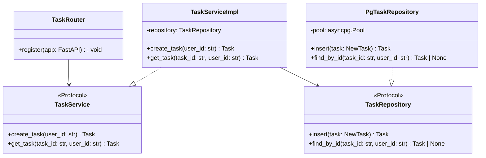

# Design: [Feature Name]

Generated during Planning. Development follows this document — do not deviate without updating it first.

## Runtime Rules (enforced before any code is written)

- All dependency management and script execution uses `uv` — never `pip`, `poetry`, or bare `python`
- `uv run`, `uv add`, `uv sync` are the only allowed commands
- Code follows PEP 8: `snake_case` for functions/variables, `PascalCase` for classes, `UPPER_CASE` for module-level constants
- Type hints on all function signatures and class fields

## Folder Structure

```
src/
  [package]/
    api/
      v1/
        [domain]_router.py      # FastAPI router, endpoint wiring only
    services/
      [domain]_service.py       # business logic, depends on repository protocol
    repositories/
      [domain]_repository.py    # data access, implements protocol
    domain/
      [domain].py               # dataclasses / Pydantic models, domain errors
    config/
      settings.py               # pydantic-settings, env loading
    util/
      logger.py                 # structured logging setup

pyproject.toml
```

## Class Diagram



## Naming Rules (enforce before writing any file)

- Files: `snake_case` — `task_service.py`, `task_repository.py`, `task_router.py`
- Classes: `PascalCase` — `TaskService`, `TaskRepository`, `TaskServiceImpl`
- Interfaces use `Protocol` (from `typing`) — not ABC, not `I` prefix
- Protocol name = the role: `TaskService`, `TaskRepository`
- Concrete name = implementation detail: `TaskServiceImpl`, `PgTaskRepository`
- Constants: `UPPER_CASE` at module level — `MAX_UPLOAD_BYTES = 25 * 1024 * 1024`
- No hardcoded strings for status/type values — use `Enum` from `enum` module
- Domain models use `dataclass` or Pydantic `BaseModel` — not plain dicts
