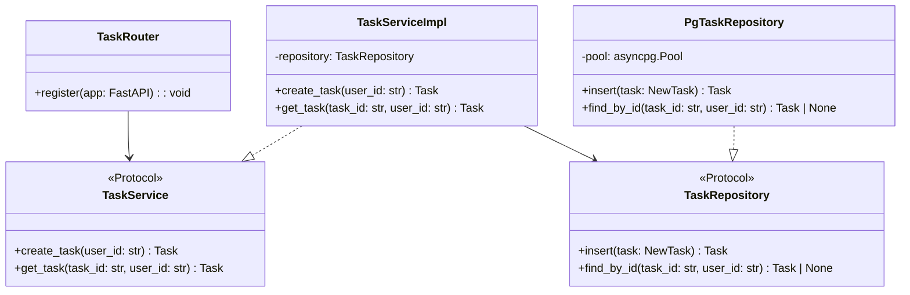

# Design: [Feature Name]

Generated during Planning. Development follows this document — do not deviate without updating it first.

## Source Inputs

- Architecture:
- Study:
- Changelog:
- Code read surface:
- User-provided inputs:
- Local operator notes, if any:

## Runtime Rules (enforced before any code is written)

- All dependency management and script execution uses `uv` — never `pip`, `poetry`, or bare `python`
- `uv run`, `uv add`, `uv sync` are the only allowed commands
- Code follows PEP 8: `snake_case` for functions/variables, `PascalCase` for classes, `UPPER_CASE` for module-level constants
- Type hints on all function signatures and class fields

## Relevant Structure

```
src/
  [package]/
    api/
      v1/
        [domain]_router.py      # FastAPI router, endpoint wiring only
    services/
      [domain]_service.py       # business logic, depends on repository protocol
    repositories/
      [domain]_repository.py    # data access, implements protocol
    domain/
      [domain].py               # dataclasses / Pydantic models, domain errors
    config/
      settings.py               # pydantic-settings, env loading
    util/
      logger.py                 # structured logging setup

pyproject.toml
```

## Boundary Diagram



## Class Responsibilities

One subsection per class or protocol in the diagram. Use this pattern:

### `ClassName`
- What it owns
- What it does not own
- Why it changed in this feature, if applicable

## Flow Mapping

Document each meaningful request/job/stream as a numbered handoff chain:

1. Entry point
2. Router / handler
3. Service orchestration
4. Repository / external dependency boundary
5. Persistence point
6. Ownership / authorization check
7. Side effects emitted
8. Terminal response or emitted event

## Naming Rules (enforce before writing any file)

- Files: `snake_case` — `task_service.py`, `task_repository.py`, `task_router.py`
- Classes: `PascalCase` — `TaskService`, `TaskRepository`, `TaskServiceImpl`
- Interfaces use `Protocol` (from `typing`) — not ABC, not `I` prefix
- Protocol name = the role: `TaskService`, `TaskRepository`
- Concrete name = implementation detail: `TaskServiceImpl`, `PgTaskRepository`
- Constants: `UPPER_CASE` at module level — `MAX_UPLOAD_BYTES = 25 * 1024 * 1024`
- No hardcoded strings for status/type values — use `Enum` from `enum` module
- Domain models use `dataclass` or Pydantic `BaseModel` — not plain dicts

## Behavior Contract

- Resource boundaries: list every user-scoped identifier and where ownership must be checked
- Endpoint matrix: each route lists request owner, allowed states, side effects, and error cases
- Job / event matrix: each queue or stream event lists producer, consumer, persistence, and replay surface
- State transitions: list allowed transitions and forbidden transitions explicitly

## Test Derivation Hooks

- Unit-test seams implied by class responsibilities
- Integration-test seams implied by flow mapping
- Acceptance / BDD seams implied by behavior contract, state transitions, and ownership rules
- Expected durable test artifact path: `<feature-folder>/test.md`

## Verification Artifacts

- Runtime checks that must be persisted or be directly reproducible from repository state
- Negative-path checks that must be evidenced
- Artifact hygiene rules for caches, uploads, generated files, and traces
- Expected durable artifact path: `<feature-folder>/verification.md`

## Approved Exceptions

- `[Exception]`:
  - Why it is allowed:
  - Scope:
  - Compensating test or verification:
