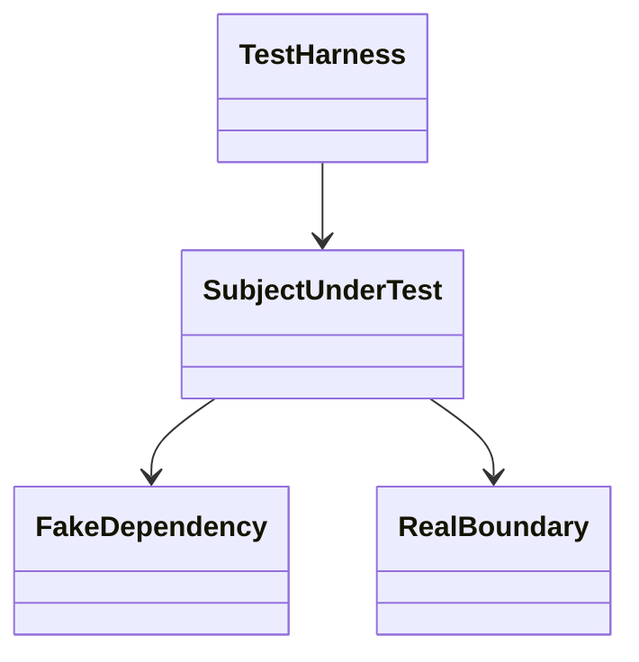

# [Feature Name] Test Contract

This document defines the approved testing contract for the active feature or phase. It derives from `design.md` and tells later development and review sessions how the design must be proven.

## 1. Test Scope
- Feature / phase:
- Depends on `design.md` version:
- Depends on `architecture.md` sections:
- Out-of-scope behaviors:

## 2. Testing Methodology
- Selected methodology: `[TDD | BDD | Follow Existing Project Pattern]`
- Why this methodology fits the feature:
- Existing project testing pattern to follow (if applicable):
- Approved exceptions to the default methodology:

## 3. Test Architecture
- Test layers in scope: `[unit | integration | acceptance | end-to-end]`
- Primary test subjects:
- Required test doubles / fixtures:
- Real dependencies allowed in test runs:
- Mock / stub / fake policy:
- Data setup / teardown rules:

## 4. Test Diagram
Use this section to show the relationship between the subject under test, test harness, fixtures, doubles, and external boundaries. Do not just repeat the production class diagram.

## 5. Test Flow Mapping
For each meaningful production flow in `design.md`, specify where it is proven.

### 5.1 [Flow Name]
- Source production flow:
- Primary layer proving it: `[unit | integration | acceptance | end-to-end]`
- Setup:
- Expected assertions:
- Ownership / authorization checks:
- Negative paths:

## 6. Traceability Matrix
Map the design contract to executable tests.

### 6.1 Class Responsibilities -> Unit Tests
- `[Design class / responsibility]` -> `[planned test file or scenario]`

### 6.2 Flow Mapping -> Integration Tests
- `[Design flow]` -> `[planned integration coverage]`

### 6.3 Behavior Contract -> Acceptance or BDD
- `[Behavior rule / state transition / ownership rule]` -> `[scenario or suite]`

## 7. Test Case Inventory

### 7.1 Happy Paths
- `[Scenario ID]`:
  - Purpose:
  - Layer:
  - Expected evidence:

### 7.2 Negative Paths
- `[Scenario ID]`:
  - Purpose:
  - Layer:
  - Expected failure mode:

### 7.3 Ownership / Authorization
- `[Scenario ID]`:
  - Boundary:
  - Layer:
  - Expected enforcement:

### 7.4 State / Lifecycle
- `[Scenario ID]`:
  - Transition:
  - Layer:
  - Expected enforcement:

## 8. Execution Rules
- Tests that must exist before implementation proceeds:
- Red -> Green -> Refactor expectations (if `TDD`):
- Scenario-first expectations (if `BDD`):
- Minimum suites that must pass before review:
- Cases allowed to be deferred and why:

## 9. Durable Artifacts
- Expected test files or suite locations:
- Required command surface:
- Expected durable evidence path: `<feature-folder>/verification.md`
- Reviewer spot-check starting points:

## 10. Approved Exceptions
- `[Exception]`:
  - Why it is allowed:
  - Compensating verification:
