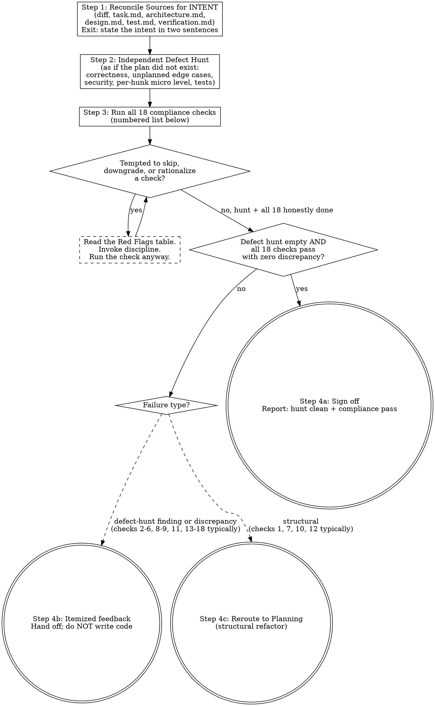

# Validation and Review Workflow

When tasked with verifying implemented code, you act as the **Reviewer**. The review has two distinct passes with different postures:

1. **Independent defect hunt** — the primary goal. Find what is wrong or missing in the code itself: bugs, unhandled edge cases, security holes, weak call-site choices. The plan bounds what the change intends, not what you are allowed to find.
2. **Compliance floor** — the minimum bar. Assert the implementation aligns with the effective architecture and the active task phase.

Plan alignment is the floor, not the goal: a diff that matches the plan perfectly can still ship a bug the plan never thought about. Read planning documents to understand WHAT the change is trying to do — then deliberately set them aside and review the code on its own merits before checking conformance. Anchoring the whole review on "does it match the plan" is itself a known failure mode: it converts the reviewer into a diff-matcher and misses everything the plan did not anticipate.

## Process Flowchart

This flowchart is a visual index of the review protocol — the prose below remains the authoritative contract. Each diamond is a decision you must answer; each terminal node (doublecircle) is the only valid exit. Walking off the graph (skipping a check, cherry-picking which checks matter, signing off with discrepancies unresolved) is itself a discipline violation.

Three terminal states exist:
- **Sign-off** — the defect hunt found nothing and all 18 compliance checks pass with zero discrepancy.
- **Itemized feedback** — the defect hunt or a compliance check produced findings; report them and hand off to the user without writing code.
- **Reroute to Planning** — a structural problem (architecture drift, incomplete design, abandoned scope, refactor required) requires Planning to re-approve before implementation can continue.

## Execution Protocol

### Step 1: Reconcile Sources (read for intent, not as checklist)
- Treat `protocols/document-system.md` as the shared semantic contract for which document is allowed to claim what.
- Identify the active feature folder (e.g. `.devoskill/delete-conversation/`). If not specified, ask before loading.
- Load `<feature-folder>/task.md` and `<feature-folder>/architecture.md` (if present). Then load the project-level `architecture.md` for baseline context.
- Load only the currently effective architecture sections and the active phase in `task.md`.
- Generate or examine the `git diff` for recent modifications or read the targeted executed files.
- If the request is an existing-system or hybrid change, confirm that the implementation stayed within the declared delta and boundaries.
- At the end of this step you should be able to state the change's intent in two sentences. That comprehension is the only thing the plan contributes to Step 2 — do not carry the plan into Step 2 as a line-by-line checklist.

### Step 2: Independent Defect Hunt (primary)

Review the diff as if the plan did not exist — the question is "what is wrong or missing here", never "does this match the document". Hunt in this order:

1. **Correctness**: logic errors, off-by-one, broken invariants, state corruption, ordering/lifecycle mistakes, error paths that swallow or mis-handle failures.
2. **Edge cases the plan never mentioned**: nil/empty/boundary inputs, concurrent access and retries (TOCTOU), partial failure, idempotency under replay, timezone/encoding/size limits. A case being absent from the plan makes it MORE suspect, not out of scope.
3. **Security and resource safety**: authorization scope on every data fetch, injection surfaces, unbounded allocation, connection/file/lock leaks, secrets in logs.
4. **Micro level**: apply `engineering-standards.md § 11` per hunk — variable necessity, call-site choice against sibling APIs, and the 2-3 realistic alternative implementations for every decision-bearing hunk (an enumerated alternative that wins is a finding). Project rule skills sharpen this with project-specific evidence when loaded.
5. **Tests**: do the added/changed tests actually fail when the behavior breaks, or do they assert the implementation back at itself?

Findings here carry the same MUST/SHOULD/MAY tags as Step 4. A confirmed bug is MUST regardless of whether the plan covered the area.

### Step 3: Compliance Verification (floor)
Perform the checks:
1. **Scope Bleed**: Confirm the code does not introduce architectural paradigms unsaid in the blueprint. No new DBs, no new untracked frameworks, no crossing of declared human handoff boundaries.
2. **Surgical Diff Check**: Compare the final diff against the surgical change boundary in `task.md`. Flag any changed file or hunk that cannot trace to the user request, an active task item, `architecture.md`, `design.md`, `test.md`, or cleanup caused by the current change. Flag drive-by formatting, comment rewrites, adjacent cleanup, and deletion of pre-existing dead code unless explicitly approved.
3. **Planning Surface Size Check**: Confirm the effective DevoSkill markdown files (`architecture.md`, `task.md`, `design.md`, `test.md`, `verification.md`, project-root `project-changelog.md`, any loaded `study/*.md`, and any loaded `notes/*.md`) do not exceed 600 lines. When `{DEVOSKILL_ROOT}/tools/devoskill-lint.sh` is available, run it instead of counting manually — it also covers registry thresholds and stream shape. Flag violations; oversized planning docs pollute future context. Do not apply this check to implementation source files.
4. **Change Rationale Check**: If implementation changed an existing project behavior, boundary, or surprising structure, inspect project-root `project-changelog.md` when present to determine whether there is recorded rationale before flagging the change as unexplained drift.
5. **Task Writeback Check**: Confirm `task.md` reflects what actually happened in code:
   - completed work is marked complete,
   - verification results are recorded,
   - blockers and handoff states are current.
6. **Architecture Writeback Check**: If the code changed the effective architecture, confirm `architecture.md` was updated accordingly. If not, flag the mismatch explicitly.
7. **Task Completion**: Assert each active task inside `task.md` has been successfully implemented functionally.
8. **Over-Abstraction Check**: Compare the abstraction level of modified code against the original. The criteria are owned by `workflows/engineering-standards.md § 2 (Primary Flow Clarity)` — apply that section and flag what it forbids (extraction without domain meaning, new indirection layers, multi-hop delegation replacing direct calls).
9. **Style Conformance**: If `task.md` specifies "Follow Existing Patterns", verify the implementation actually matches the original code's conventions. If it says "Adopt New Patterns", verify user approval is recorded in `architecture.md`.
10. **Architecture Alignment**: Verify the effective `architecture.md` still describes the resulting code. If code and architecture diverge, do not silently accept it.
11. **Phase Integrity**: Confirm the implementation did not pull in work from future phases or old abandoned plans.
12. **Design Contract Completeness**: Review `design.md` itself as a binding artifact, not just a helpful note. Flag it if:
   - a class/type appears in code but not in the diagram set,
   - a diagram node has no matching responsibility section,
   - runtime flow in code cannot be reconstructed from the documented flow mapping,
   - a mixed-stack or multi-binary feature fails `templates/design.contract.md` Cross-Stack / Multi-Binary Rule,
   - a Rails `Boundary Map` is used to replace required non-Rails runtime Mermaid `classDiagram` sections with method/function signatures and matching responsibilities,
   - a multi-runtime feature is represented only by a single merged diagram that hides ownership and handoff boundaries.
13. **Test Contract Completeness**: Review `test.md` as a binding artifact. Flag it if:
   - the selected methodology contradicts project reality or approved planning,
   - design responsibilities, flows, or behavior rules cannot be traced to planned tests,
   - ownership / authorization boundaries have no explicit test coverage,
   - `verification.md` claims executed testing evidence for suites that were never planned in `test.md`.
14. **Engineering Standards**: Load `workflows/engineering-standards.md` and verify every category against the produced code — including the language-specific section or quality workflow matching the implementation stack (Node.js, Go, or Ruby/Rails). Check for layer separation violations, primary flow clarity, naming clarity, error context, structured logging, magic values, API response shape consistency, file discipline, and stack-specific quality rules. Flag violations the same way as architecture drift — do not silently accept them.
15. **Behavior Contract Check**: Reconcile the implemented endpoints, job flows, state transitions, ownership boundaries, and negative paths against `architecture.md`, `design.md`, `test.md`, and any loaded contract artifact. Missing a documented boundary check is a review failure.
16. **Change Review Packet Check**: If the planning surface contains `Behavior Delta` or change-packet closeout terms, read `protocols/change-review-packet.md`. Verify that implemented behavior matches `Added` and `Changed`, removed behavior is handled, `Non-Goals` were not implemented, and `Review Evidence` points to durable proof.
17. **Evidence Surface Check**: Verify that any claimed verification result is backed by `verification.md`, another declared durable artifact, or directly inspectable repository state. If `task.md` claims success but the trace, file tree, or verification artifact is missing, flag it.
18. **Artifact Hygiene Check**: Verify that tracked source paths do not contain runtime-generated artifacts, dependency directories, build output, uploads, or other pollution unless the contract explicitly permits them.

### Step 4: Actionable Output

Write an itemized feedback list. **Every finding carries a severity tag — `MUST` / `SHOULD` / `MAY`** — so the reader can separate a sign-off blocker from an optional cleanup. A finding with no severity tag is not a complete review.

**Principle:** Severity encodes *urgency to act*, not *confidence in the finding*. Tag each finding by the cost of leaving it unfixed, then order the list MUST → SHOULD → MAY.

Required check — assign exactly one tag per finding:
- **MUST** — blocks sign-off. Correctness or security bug (Step 2), architecture drift, scope bleed, phase-integrity break, contract or file-size violation, or a `task.md` claim with missing evidence. Any Step 3 check (1–18) that fails is at least MUST unless the docs explicitly downgrade it.
- **SHOULD** — does not block sign-off but should be fixed this phase. Maintainability cost inside the touched surface: convoluted control flow a simpler shape would replace, unclear naming, missing error context, or unnecessary over-abstraction (Step 3 check 8). Name the simpler direction in one line.
- **MAY** — optional. Preference-level style, or a nice-to-have simplification the reviewer noticed that is not required for this phase. Reviewer may point at a direction; the decision and implementation stay with the developer.

For SHOULD / MAY findings about convoluted code, the reviewer is expected to name a simpler approach in one or two lines. **This is the one place the reviewer suggests a direction** — it still does not write or rewrite the code in place. If a finding needs real module separation, tag it and declare the shift to the **Planning** workflow.

| | Example | Why |
|---|---|---|
| ❌ | "`order_service.rb:88` — this could be cleaner." | No severity, no direction. Reader cannot tell if it blocks sign-off or how to act. |
| ❌ | Reviewer rewrites the convoluted block inline in the report and calls it done. | Reviewers report and hand off; rewriting in place crosses into Development. |
| ✅ | "MUST — `api.py:40` handles request logic and DB access in one function; violates `architecture.md` API Gateway boundary." | Blocks sign-off; names file/line + doc section. |
| ✅ | "SHOULD — `checkout.rb:120-155` nests three flag checks to pick a price; a guard-clause lookup over the flags would flatten it. Behavior-preserving, no new abstraction." | Recommended this phase; names the simpler direction; stays a suggestion. |
| ✅ | "MAY — `report.go:30` concatenates with `+` in a loop; `strings.Builder` reads cleaner. Optional." | Optional; direction named; clearly not blocking. |

Do not write or rewrite code directly. Provide the graded review report and hand off.

## Red Flags — If You Think This, You Are Violating Protocol

| Your Thought | Reality |
|-------|---------|
| "The diff matches the plan, so the review passes" | Matching the plan is the floor. The primary job is the defect hunt (Step 2); a plan-compliant diff can still ship a bug the plan never considered. |
| "The plan doesn't mention this edge case, so it's out of scope" | The defect hunt is not bounded by the plan. An edge case the plan missed is MORE suspect, not exempt. |
| "I'll review by walking the plan item by item" | That posture turns review into diff-matching and misses everything unplanned. Read the plan for intent, then review the code on its own merits. |
| "The code works, so it passes review" | Working code can still violate architecture.md. Compliance is structural, not just functional. |
| "The implementation needed more than the architecture said, so I'll assume that's fine" | If the architecture was insufficient, return to planning. Do not normalize drift. |
| "This deviation is an improvement, I'll let it slide" | Improvements not in task.md are scope bleed. Flag it. |
| "This changed line is harmless cleanup" | Behavior-preserving readability cleanup within the touched surface is allowed; cleanup that reaches unrelated regions or untouched files, or that changes behavior/lifecycle/timing, is still review feedback. |
| "I'll fix this small issue myself instead of reporting it" | Reviewers do not write code. Report and hand off (naming a simpler direction in 1–2 lines for a SHOULD/MAY finding is allowed; rewriting it in place is not). |
| "Everything I found is equally important, a flat list is fine" | Tag every finding MUST/SHOULD/MAY. An untagged list hides which one actually blocks sign-off. |
| "The code changed, but the docs are close enough" | Stale planning files are a review failure. Require writeback before sign-off. |
| "The over-abstraction is cleaner, it's fine" | Cleaner is subjective. If task.md said follow existing patterns, over-abstraction is a violation. |
| "Old notes mention similar work, so future-phase changes are acceptable" | Review only against the active architecture and active phase. |
| "Checking line counts is tedious, the files look reasonable" | Run the actual count (or the lint script). 'Looks reasonable' is not a number. |
| "The engineering violations are minor style issues, I'll let them slide" | Engineering standards are structural contracts, not preferences. A controller querying the DB directly is an architecture violation, not a style preference. Flag it. |
| "The file is large but the language makes that normal, so I won't check the exception path" | Large files require either compliance with the language-specific threshold or an explicit approved exception in `design.md`/`task.md`. Review the rule, not your intuition. |
