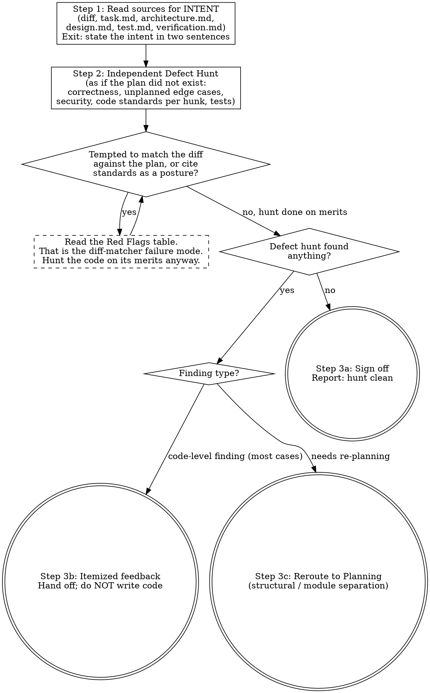

# Validation and Review Workflow

When tasked with reviewing implemented code, you act as the **Reviewer**. Review is one thing: an **independent defect hunt over the code's own merits** — bugs, unhandled edge cases, security holes, weak call-site choices, missing-or-ineffective tests, and code-standard violations. Find what is wrong or better in the code, regardless of what the plan said.

Two concerns that used to live here have moved, so Review cannot degenerate into diff-matching:

- **Plan conformance** (scope bleed, surgical-diff boundary, style conformance, phase integrity, design/test/behavior contract, change-packet match) → owned by Development's **Plan Conformance Checkpoint** (`workflows/02-development.md`), run as a self-check mid-implementation and at completion.
- **Closeout** (task/architecture writeback, evidence surface, task completion, planning-surface size, change rationale, artifact hygiene, plus a decoupled re-verify of scope bleed / architecture drift) → owned by `workflows/closeout-review.md`, run at handoff.

Read planning documents only to understand WHAT the change intends — then set them aside and review the code on its own merits. Anchoring the review on "does it match the plan" is a known failure mode: it turns the reviewer into a diff-matcher and misses everything the plan never anticipated. (`docs/DevoSkill/doctrine.md` §11: compliance is the floor, the independent defect hunt comes first.)

## Process Flowchart

This flowchart is a visual index of the review protocol — the prose below remains the authoritative contract. Each diamond is a decision you must answer; each terminal node (doublecircle) is the only valid exit. Walking off the graph (skipping the hunt, anchoring on the plan, signing off with findings unresolved) is itself a discipline violation.

Three terminal states exist:
- **Sign-off** — the defect hunt found nothing.
- **Itemized feedback** — the hunt produced findings; report them MUST/SHOULD/MAY and hand off to the user without writing code.
- **Reroute to Planning** — a structural problem (a finding that needs real module separation or re-approved scope) requires Planning before implementation can continue.

Conformance and closeout are deliberately absent from this graph — they are separate modules (Development's checkpoint and `closeout-review.md`), not steps of the code-quality review.

## Execution Protocol

### Step 1: Read For Intent (not as a checklist)
- Identify the active feature folder (e.g. `.devoskill/delete-conversation/`). If not specified, ask before loading.
- Load `<feature-folder>/task.md` (active phase), `design.md`, `test.md`, then relevant `architecture.md` sections, then `verification.md` — enough to state the change's intent in two sentences.
- Generate or examine the `git diff`, or read the targeted files.
- That two-sentence intent is the ONLY thing the plan contributes. Do not carry the plan into Step 2 as a line-by-line checklist.

### Step 2: Independent Defect Hunt
Review the diff as if the plan did not exist — the question is "what is wrong, missing, or better here", never "does this match the document". Hunt in this order:

1. **Correctness**: logic errors, off-by-one, broken invariants, state corruption, ordering/lifecycle mistakes, error paths that swallow or mis-handle failures.
2. **Edge cases the plan never mentioned**: nil/empty/boundary inputs, concurrent access and retries (TOCTOU), partial failure, idempotency under replay, timezone/encoding/size limits. A case being absent from the plan makes it MORE suspect, not out of scope.
3. **Security and resource safety**: authorization scope on every data fetch, injection surfaces, unbounded allocation, connection/file/lock leaks, secrets in logs.
4. **Code standards (they live here)**: apply `workflows/engineering-standards.md` in full against the touched code — layer separation, primary flow clarity, naming clarity, error context, structured logging, magic values, API response shape, file discipline, **over-abstraction** (§2 Primary Flow Clarity: flag extraction without domain meaning, new indirection layers, multi-hop delegation replacing direct calls), and the language-specific section or quality workflow matching the stack (Node.js, Go, Ruby/Rails). Then apply `engineering-standards.md § 11` per decision-bearing hunk — variable necessity, call-site choice against sibling APIs, and the 2-3 realistic alternative implementations (an enumerated alternative that wins is a finding). Stack-specific rule skills (e.g. a project's micro-review rule skill, discovered via R7/registry routing) sharpen this with project evidence.
5. **Tests**: do the added/changed tests actually fail when the behavior breaks, or do they assert the implementation back at itself?

A confirmed bug is MUST regardless of whether the plan covered the area.

### Step 3: Actionable Output

Write an itemized feedback list. **Every finding carries a severity tag — `MUST` / `SHOULD` / `MAY`** — so the reader can separate a sign-off blocker from an optional cleanup. A finding with no severity tag is not a complete review. This severity scheme is the canonical one; `closeout-review.md` and Development's conformance checkpoint reference it.

**Principle:** Severity encodes *urgency to act*, not *confidence in the finding*. Tag each finding by the cost of leaving it unfixed, then order the list MUST → SHOULD → MAY.

Required check — assign exactly one tag per finding:
- **MUST** — blocks sign-off. Correctness or security bug, or a code-standard violation that is structural (a layer-separation break, an unsafe call-site chosen over a safe sibling).
- **SHOULD** — does not block sign-off but should be fixed this phase. Maintainability cost inside the touched surface: convoluted control flow a simpler shape would replace, unclear naming, missing error context, or unnecessary over-abstraction. Name the simpler direction in one line.
- **MAY** — optional. Preference-level style, or a nice-to-have simplification the reviewer noticed that is not required for this phase. Reviewer may point at a direction; the decision and implementation stay with the developer.

For SHOULD / MAY findings about convoluted code, the reviewer is expected to name a simpler approach in one or two lines. **This is the one place the reviewer suggests a direction** — it still does not write or rewrite the code in place. If a finding needs real module separation, tag it and declare the shift to the **Planning** workflow.

| | Example | Why |
|---|---|---|
| ❌ | "`order_service.rb:88` — this could be cleaner." | No severity, no direction. Reader cannot tell if it blocks sign-off or how to act. |
| ❌ | Reviewer rewrites the convoluted block inline in the report and calls it done. | Reviewers report and hand off; rewriting in place crosses into Development. |
| ✅ | "MUST — `order_service.rb:88` reads a cached association's `size` mid-batch; the value is stale after in-loop deletes, so the guard is bypassed. Use a fresh `count`." | Blocks sign-off; names file/line + the defect. |
| ✅ | "SHOULD — `checkout.rb:120-155` nests three flag checks to pick a price; a guard-clause lookup over the flags would flatten it. Behavior-preserving, no new abstraction." | Recommended this phase; names the simpler direction; stays a suggestion. |
| ✅ | "MAY — `report.go:30` concatenates with `+` in a loop; `strings.Builder` reads cleaner. Optional." | Optional; direction named; clearly not blocking. |

Do not write or rewrite code directly. Provide the graded review report and hand off. If conformance or closeout concerns surface during the hunt, note them and point at the owning module (Development checkpoint / `closeout-review.md`) rather than re-running those checklists here.

## Red Flags — If You Think This, You Are Violating Protocol

| Your Thought | Reality |
|-------|---------|
| "The diff matches the plan, so the review passes" | Plan-matching is not Review's job at all — that moved to Development's conformance checkpoint. Review hunts defects in the code on its own merits. |
| "The plan doesn't mention this edge case, so it's out of scope" | The defect hunt is not bounded by the plan. An edge case the plan missed is MORE suspect, not exempt. |
| "I'll review by walking the plan item by item" | That posture turns review into diff-matching and misses everything unplanned. Read the plan for intent, then review the code on its own merits. |
| "I'll cite rails-maintenance / quality-ruby / engineering-standards as 'our review style' before looking for bugs" | Those ARE the code standards and they belong inside Step 2 check 4 — applied to find real violations, not quoted as a posture before the hunt. |
| "The code works, so it passes review" | Working code can still carry a latent bug, an unsafe call-site, or a standards violation. Working is not the bar. |
| "This is a doc-sync / writeback problem" | That is closeout, not Review. Note it and point at `closeout-review.md`; do not absorb it into the code hunt. |
| "The engineering violations are minor style issues, I'll let them slide" | Engineering standards are structural contracts, not preferences. A controller querying the DB directly is an architecture violation (Step 2 check 4), not a style preference. Flag it. |
| "I'll fix this small issue myself instead of reporting it" | Reviewers do not write code. Report and hand off (naming a simpler direction in 1–2 lines for a SHOULD/MAY finding is allowed; rewriting it in place is not). |
| "Everything I found is equally important, a flat list is fine" | Tag every finding MUST/SHOULD/MAY. An untagged list hides which one actually blocks sign-off. |
| "The over-abstraction is cleaner, it's fine" | Cleaner is subjective. If the surrounding code is flatter, new indirection is a standards finding (Step 2 check 4). |
