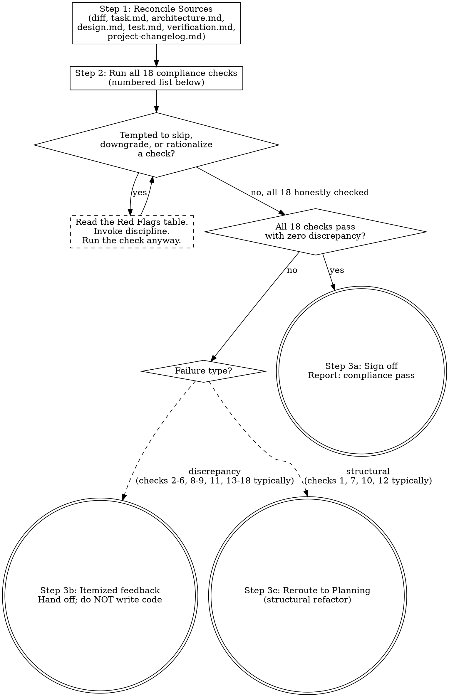

# Validation and Review Workflow

When tasked with verifying implemented code against its original plan, you act as the **Reviewer**. Your sole job is to assert compliance against the effective architecture and the active task phase.

## Process Flowchart

This flowchart is a visual index of the review protocol — the prose below remains the authoritative contract. Each diamond is a decision you must answer; each terminal node (doublecircle) is the only valid exit. Walking off the graph (skipping a check, cherry-picking which checks matter, signing off with discrepancies unresolved) is itself a discipline violation.

Three terminal states exist:
- **Sign-off** — all 18 checks pass with zero discrepancy.
- **Itemized feedback** — one or more checks flagged a discrepancy; report findings and hand off to the user without writing code.
- **Reroute to Planning** — a structural problem (architecture drift, incomplete design, abandoned scope, refactor required) requires Planning to re-approve before implementation can continue.

## Execution Protocol

### Step 1: Reconcile Sources
- Treat `protocols/document-system.md` as the shared semantic contract for which document is allowed to claim what.
- Identify the active feature folder (e.g. `.devoskill/delete-conversation/`). If not specified, ask before loading.
- Load `<feature-folder>/task.md` and `<feature-folder>/architecture.md` (if present). Then load the project-level `architecture.md` for baseline context.
- Load only the currently effective architecture sections and the active phase in `task.md`.
- Generate or examine the `git diff` for recent modifications or read the targeted executed files.
- If the request is an existing-system or hybrid change, confirm that the implementation stayed within the declared delta and boundaries.

### Step 2: Compliance Verification
Perform the checks:
1. **Scope Bleed**: Confirm the code does not introduce architectural paradigms unsaid in the blueprint. No new DBs, no new untracked frameworks, no crossing of declared human handoff boundaries.
2. **Surgical Diff Check**: Compare the final diff against the surgical change boundary in `task.md`. Flag any changed file or hunk that cannot trace to the user request, an active task item, `architecture.md`, `design.md`, `test.md`, or cleanup caused by the current change. Flag drive-by formatting, comment rewrites, adjacent cleanup, and deletion of pre-existing dead code unless explicitly approved.
3. **Planning Surface Size Check**: Confirm the effective DevoSkill markdown files (`architecture.md`, `task.md`, `design.md`, `test.md`, `verification.md`, project-root `project-changelog.md`, any loaded `study/*.md`, and any loaded `notes/*.md`) do not exceed 600 lines. Flag them if they do, since oversized planning docs pollute future context. Do not apply this check to implementation source files.
4. **Change Rationale Check**: If implementation changed an existing project behavior, boundary, or surprising structure, inspect project-root `project-changelog.md` when present to determine whether there is recorded rationale before flagging the change as unexplained drift.
5. **Task Writeback Check**: Confirm `task.md` reflects what actually happened in code:
   - completed work is marked complete,
   - verification results are recorded,
   - blockers and handoff states are current.
6. **Architecture Writeback Check**: If the code changed the effective architecture, confirm `architecture.md` was updated accordingly. If not, flag the mismatch explicitly.
7. **Task Completion**: Assert each active task inside `task.md` has been successfully implemented functionally.
8. **Over-Abstraction Check**: Compare the abstraction level of modified code against the original. Flag if:
   - Inline data structures were extracted into unnecessary wrappers (const, functions, classes).
   - New indirection layers were introduced that did not exist before (factories, builders, adapters).
   - Simple direct calls were replaced with multi-hop delegation chains.
9. **Style Conformance**: If `task.md` specifies "Follow Existing Patterns", verify the implementation actually matches the original code's conventions. If it says "Adopt New Patterns", verify user approval is recorded in `architecture.md`.
10. **Architecture Alignment**: Verify the effective `architecture.md` still describes the resulting code. If code and architecture diverge, do not silently accept it.
11. **Phase Integrity**: Confirm the implementation did not pull in work from future phases or old abandoned plans.
12. **Design Contract Completeness**: Review `design.md` itself as a binding artifact, not just a helpful note. Flag it if:
   - a class/type appears in code but not in the diagram set,
   - a diagram node has no matching responsibility section,
   - runtime flow in code cannot be reconstructed from the documented flow mapping,
   - a mixed-stack or multi-binary feature fails `templates/design.contract.md` Cross-Stack / Multi-Binary Rule,
   - a Rails `Boundary Map` is used to replace required non-Rails runtime Mermaid `classDiagram` sections with method/function signatures and matching responsibilities,
   - a multi-runtime feature is represented only by a single merged diagram that hides ownership and handoff boundaries.
13. **Test Contract Completeness**: Review `test.md` as a binding artifact. Flag it if:
   - the selected methodology contradicts project reality or approved planning,
   - design responsibilities, flows, or behavior rules cannot be traced to planned tests,
   - ownership / authorization boundaries have no explicit test coverage,
   - `verification.md` claims executed testing evidence for suites that were never planned in `test.md`.
14. **Engineering Standards**: Load `workflows/engineering-standards.md` and verify every category against the produced code — including the language-specific section or quality workflow matching the implementation stack (Node.js, Go, or Ruby/Rails). Check for layer separation violations, primary flow clarity, naming clarity, error context, structured logging, magic values, API response shape consistency, file discipline, and stack-specific quality rules. Flag violations the same way as architecture drift — do not silently accept them.
15. **Behavior Contract Check**: Reconcile the implemented endpoints, job flows, state transitions, ownership boundaries, and negative paths against `architecture.md`, `design.md`, `test.md`, and any loaded contract artifact. Missing a documented boundary check is a review failure.
16. **Change Review Packet Check**: If the planning surface contains `Behavior Delta` or change-packet closeout terms, read `protocols/change-review-packet.md`. Verify that implemented behavior matches `Added` and `Changed`, removed behavior is handled, `Non-Goals` were not implemented, and `Review Evidence` points to durable proof.
17. **Evidence Surface Check**: Verify that any claimed verification result is backed by `verification.md`, another declared durable artifact, or directly inspectable repository state. If `task.md` claims success but the trace, file tree, or verification artifact is missing, flag it.
18. **Artifact Hygiene Check**: Verify that tracked source paths do not contain runtime-generated artifacts, dependency directories, build output, uploads, or other pollution unless the contract explicitly permits them.

### Step 3: Actionable Output
If discrepancies exist, write an itemized feedback list (e.g., "File api.py handles logic and db requests; this violates `architecture.md` API Gateway model.")
If a refactor is required, declare the need to shift to the **Planning** workflow for module separation.
Do not write or rewrite code directly. Provide the review report and hand off.

## Red Flags — If You Think This, You Are Violating Protocol

| Your Thought | Reality |
|-------|---------|
| "The code works, so it passes review" | Working code can still violate architecture.md. Compliance is structural, not just functional. |
| "The implementation needed more than the architecture said, so I'll assume that's fine" | If the architecture was insufficient, return to planning. Do not normalize drift. |
| "This deviation is an improvement, I'll let it slide" | Improvements not in task.md are scope bleed. Flag it. |
| "I'll fix this small issue myself instead of reporting it" | Reviewers do not write code. Report and hand off. |
| "The code changed, but the docs are close enough" | Stale planning files are a review failure. Require writeback before sign-off. |
| "The over-abstraction is cleaner, it's fine" | Cleaner is subjective. If task.md said follow existing patterns, over-abstraction is a violation. |
| "Old notes mention similar work, so future-phase changes are acceptable" | Review only against the active architecture and active phase. |
| "Checking line counts is tedious, the files look reasonable" | Run the actual count. 'Looks reasonable' is not a number. |
| "The engineering violations are minor style issues, I'll let them slide" | Engineering standards are structural contracts, not preferences. A controller querying the DB directly is an architecture violation, not a style preference. Flag it. |
| "The file is large but the language makes that normal, so I won't check the exception path" | Large files require either compliance with the language-specific threshold or an explicit approved exception in `design.md`/`task.md`. Review the rule, not your intuition. |
