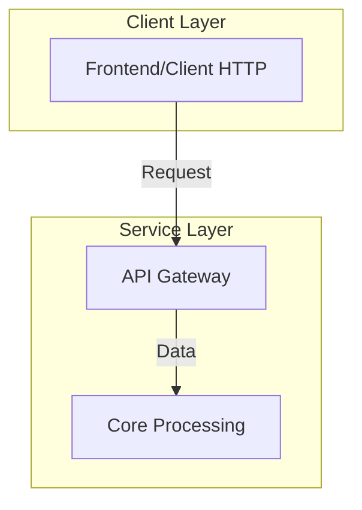

# [Project Name] Architecture Blueprint

Briefly describe the objective of this architecture blueprint. State what the system does and why this architecture was chosen (e.g., performance optimization, refactoring, new feature).

## 1. System Objectives
List the 3-5 high-level goals of this architectural design.
*   **[Goal 1]**: E.g., Extreme Speed (latency < 250ms).
*   **[Goal 2]**: E.g., CPU Efficiency (resource utilization).
*   **[Goal 3]**: E.g., Simplified Stack (maintainability).

## 2. High-Level Architecture
Provide a Mermaid flowchart diagram showing the macro components and data flow.


## 3. Core Design
Detail the critical logic paths or algorithms being used.

### 3.1 [Core Component 1]
*   **[Design Choice]**: Explain the 'why' and 'how'.
*   **[Optimization]**: Details on performance choices.

### 3.2 [Core Component 2]
*   **[Design Choice]**: Further explanation of the stack or database strategy.

## 4. Benchmarks / KPIs (If Applicable)
Define the metrics that will determine if this architecture is successful.
| Metric | Target | Current | Notes |
|---|---|---|---|
| P50 Latency | < 250ms | ~1.5s | Goal is to reduce by 6x |
| CPU Usage | < 10% | ~30% | Offload to GPU |

## 5. Project Layout
Show the target directory structure.
```text
/
├── component1/              # Logic for X
│   └── main.py
├── component2/              # Logic for Y
└── docker-compose.yml       # Deployment schema
```

## 6. Resource Strategy
*   **Memory/VRAM**: Expected footprint.
*   **CPU**: Threading strategy or scaling limits.

---
**Architectural Notes**: Any final remarks, warnings, or transition notes for the developer.
